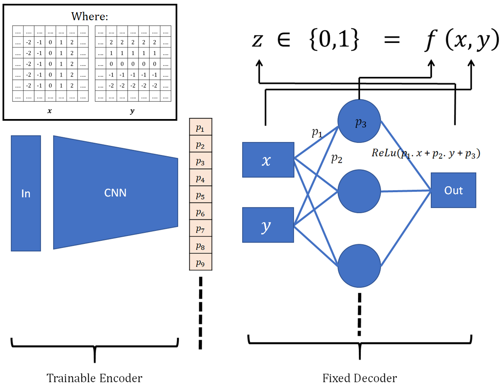
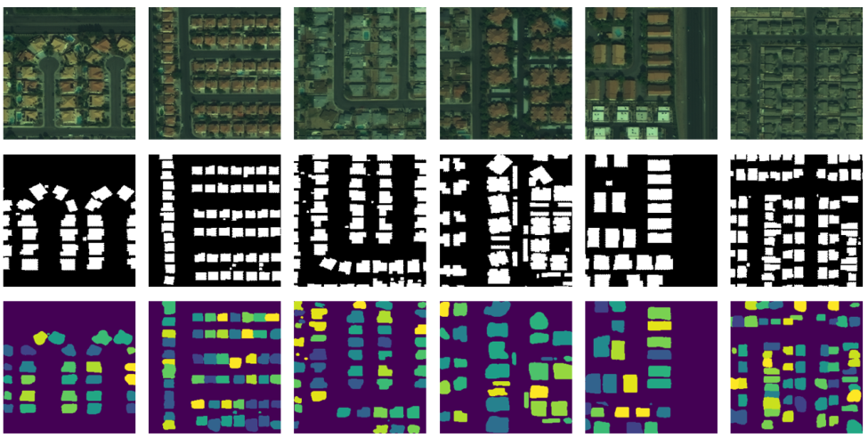

# Vec2Instance - Parameterization for Deep Instance Segmentation

This repository provides an implementation of Vec2Instance over the SpaceNet challenge AOI 2 (Vegas) building footprint dataset. And this is published in [arXiv](#).

### Introduction

Vec2Instance provides a framework for parametrization of instances, allowing convolutional neural networks to efficiently estimate the complex shapes of instances around their centroids. We demonstrate the feasibility of the proposed architecture with respect to instance segmentation tasks on satellite images, which have a wide range of applications. Moreover, we demonstrate the usefulness of the new method for extracting building foot-prints from satellite images. Vec2Instance is an alternative approach to complex instance segmentation pipelines, offering simplicity and intuitiveness.

Core concept of Vec2Instance is as below,
* An instance mask is a multivariate function in two dimensions. The input to the multivariate function is a pixel location (x and y coordinate values), and the
output of the multivariate function should be 1 if the location is inside the mask and 0 otherwise.
* This function can be approximated by an vanilla neural network (MLP). And the weights and biases of this vanilla neural network (MLP) can be considered as parameters that represent an instance mask (building shape). 
* Now, we have a way to parametrize an instance mask. Then, a CNN can be used to learn those parameters and then those parameters can be re-arranged as weights and biases of vanilla neural network (MLP). And this vanilla neural network (MLP) applied on pixel coordinates centered at the centroid of each instance, outputting instance mask (building shape) for each instance. One way to think of the model is as a neural network (CNN) that predicts the weights and biases of another neural network (a vanilla multilayer perceptron).

Whole concept is summerized in following figure,

And some of the results we have obtained is shows in following figure (Input images are in first row, ground truth images are in second row, and predictions from Vec2Instance are in third row),

### Libraries used

* numpy
* matplotlib
* tensorflow v1.12.0 (keras)

### Content

Proposed new neural network architecture for the instance segmentation task comprising two CNNs. The first CNN estimates centroids of instances, and the second CNN preforms instance segmentation around each centroid. So there are 4 notebooks in this repository. First 2 notebooks are for training of Centroid Estimation CNN and Instance Segmentation CNN. And the third notebook is for the prediction process, combining the results of Centroid Estimation CNN and Instance Segmentation CNN. Final (4th) notebook is about aditional application of Vec2Instance (face Reconstruction by prametrizing faces with Vec2Instance).

* Notebook I: Training the Centroid Estimation CNN
* Notebook II: Training the Instance Segmentation CNN
* Notebook III: Prediction
* Notebook IV: Face Reconstruction with Vec2Instance

### Citation

Cite our paper

### Sample data source

* SpaceNet. (2018). Spacenet on Amazon Web Services (AWS). ”Datasets.” The SpaceNet Catalog. https://spacenetchallenge.github.io/datasets/datasetHomePage.html.
* 
